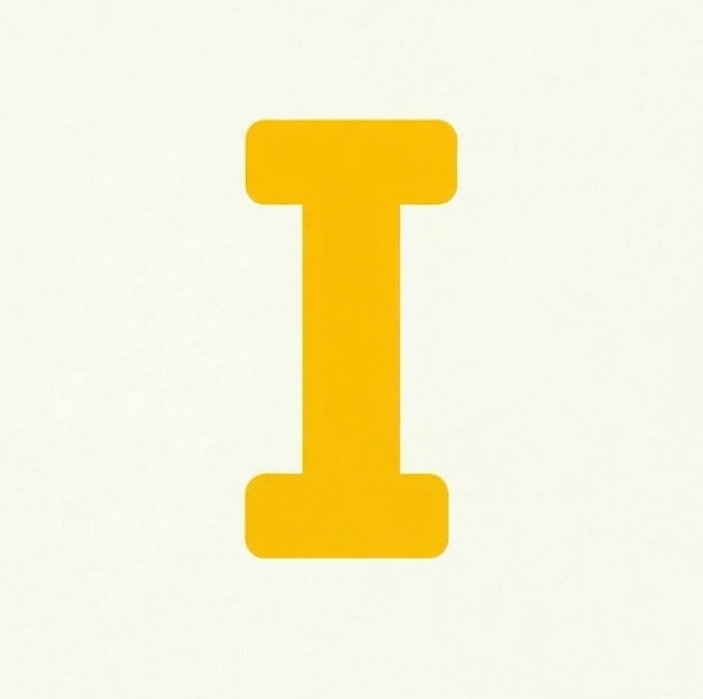

# 💀 Impostor Game

Modern PWA implementation of the classic "Impostor" social deduction game. Didn't want to pay for a app, so I build my own.



## Tech Stack

- **Frontend**: React 18 + Vite
- **Styling**: Tailwind CSS (Custom Cream & Yellow Theme)
- **Animace**: Framer Motion (3D Card Flips)
- **Ikony**: Lucide React
- **Stav**: React Hooks + LocalStorage Persistence

## ✨ Functionalities

- **Dark Mode**: Full support for dark mode with a toggle.
- **PWA Ready**: Option to install as a mobile application.
- **Persistent State**: Player names and category preferences are saved in the browser.
- **Modularity**: Word categories are stored in external CSV files for easy editing.
- **Subtilní nápovědy**: Strategic hints designed to help the impostor guess without revealing themselves.

## 📂 Project Structure

```text
src/
├── data/
│   └── categories/      # CSV files with words and hints
├── lib/                 # Utility (clsx, tailwind-merge)
├── App.jsx              # Main game logic and UI
└── index.css            # Global styles and HSL variables
```

## 📝 How to add custom words

The game uses a modular category system in `src/data/categories/`. To add or edit words:

1. Open the appropriate `.csv` file (e.g., `zvirata.csv`).
2. Add a line in the format: `Word,SubtilníNápověda`
   - *Example: `Paříž,Bageta`*
3. The category export is managed in `src/data/categories/index.js`.

## 🛠️ Local Development

```bash
# Install dependencies
npm install

# Run development server
npm run dev

# Build for production
npm run build
```

---
